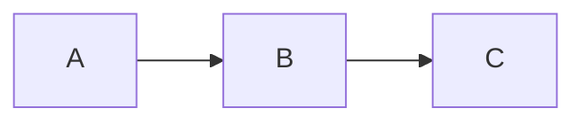

+++
weight = 20
+++

# Usage

---

## Prerequisite

First, add this to your `config.toml`:

```toml
[outputFormats.Reveal]
baseName = "index"
mediaType = "text/html"
isHTML = true
```

---

### Presentation at site root

Create `content/_index.md`:

```markdown
+++
outputs = ["Reveal"]
+++

# Slide 1

Hello world!
```

---

### Add slides

Separate them by `---` surrounded by blank lines:

```
# Slide 1

Hello world!

---

# Slide 2

Hello program!
```

---

### Mermaid

Slides can contain [mermaid](https://mermaid-js.github.io/mermaid/#/) diagrams:

````code

````

Or (see [mermaid shortcode](#/mermaid-shortcode))

```code

graph LR
    A --> B
    B --> C

```

results in:


graph LR
    A --> B
    B --> C


<small>💡 Note: for codeblocks support (` ```mermaid ...``` `), hugo highlighting must be on (codeFences = true in config.toml)</small>


---

### Add slides with other files

Add slides to `content/home/*.md`

```markdown
+++
weight = 10
+++

# Slide 3

---

# Slide 4
```

<small>💡 Tip: Use `weight` to specify the order that files should be considered.</small>

---

### Presentation at '/{section}/'

Add slides to `content/{section}/_index.md`:

```markdown
+++
outputs = ["Reveal"]
+++

# Slide 1

---

# Slide 2
```

---

Add slides from other files in `content/{section}/*.md`

```markdown
+++
weight = 10
+++

# Slide 3

---

# Slide 4
```

<small>💡 Tip: Use `weight` to specify the order that files should be considered.</small>

